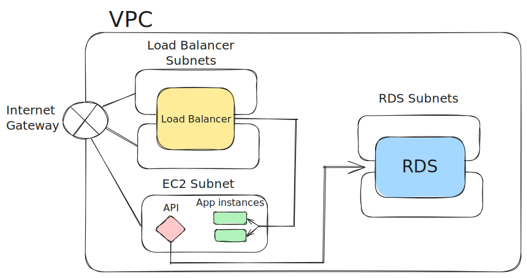

# projeto-cloud

## Diagrama da infraestrutura



## Criação da infraestrutura na AWS

Após clonar o repositório, execute os comandos abaixo para criar a infraestrutura na AWS.

Certifique-se de ter o terraform instalado e configurado com as credenciais da AWS.

```
terraform init
```

```
terraform apply --auto-approve
```
